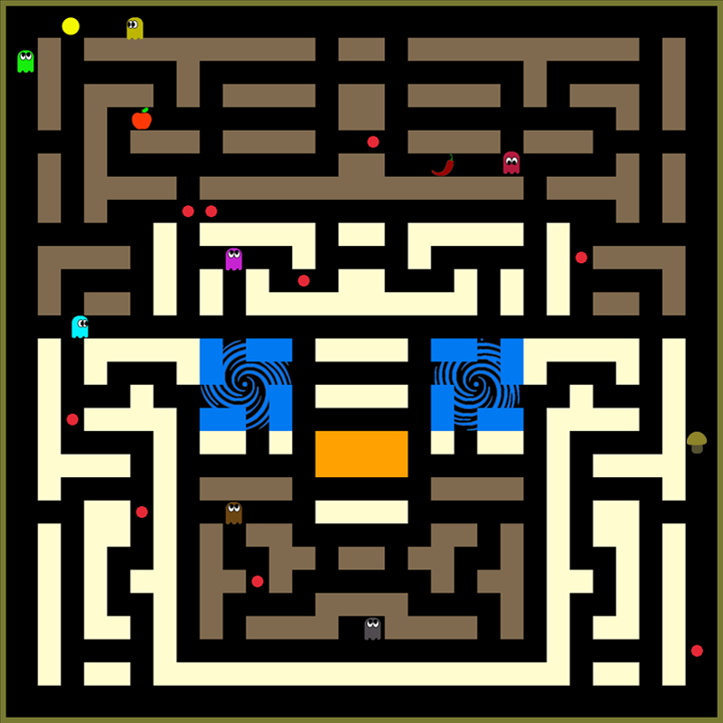

# 🕹️ Pacman Game (C / Raylib)

This is a classic **Pacman** game clone written in **C** using the **[raylib](https://www.raylib.com/)** graphics library. Navigate the maze, eat the pellets, avoid the ghosts – and chase the fruits for extra points!

## 📸 Screenshots


## 🚀 Features

- Classic Pacman gameplay mechanics
- Ghost AI behavior
- Score tracking and high score saving
- Multiple levels and increasing difficulty
- Retro-style UI and graphics

## 🧰 Requirements

- C Compiler (e.g., `gcc`)
- [raylib](https://github.com/raysan5/raylib) installed on your system

## 🛠️ Build Instructions

### On Windows (with `raylib` installed):

```bash
gcc codes/main.c codes/structures.c codes/initial_functions.c codes/pacman.c codes/game.c codes/ghosts.c codes/window.c codes/fruits.c codes/records.c codes/menu.c -o Pacman -I path/to/raylib/include -I codes -L path/to/raylib/lib -lraylib -lopengl32 -lgdi32 -lwinmm

